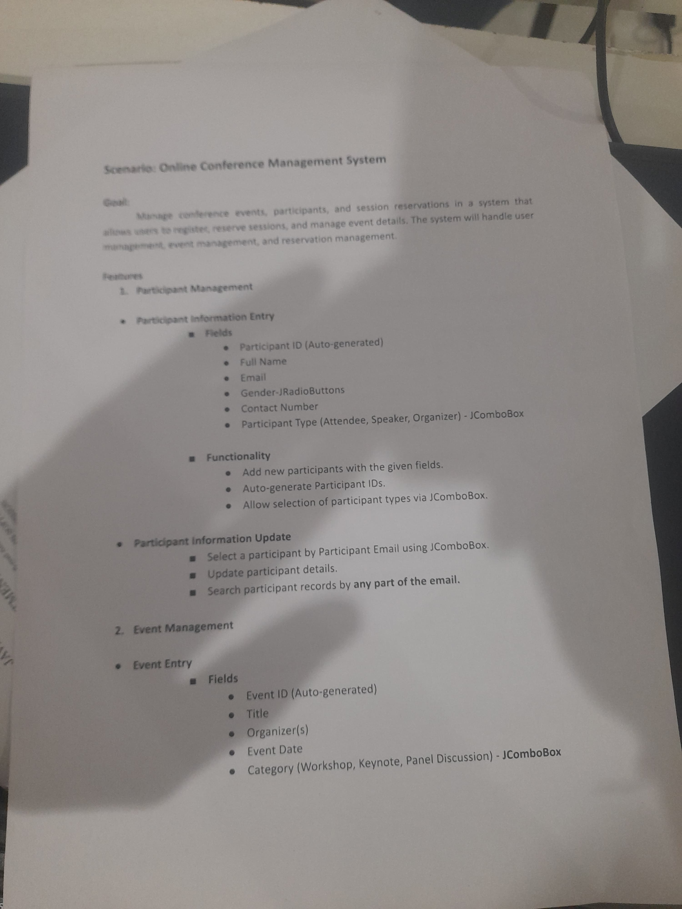
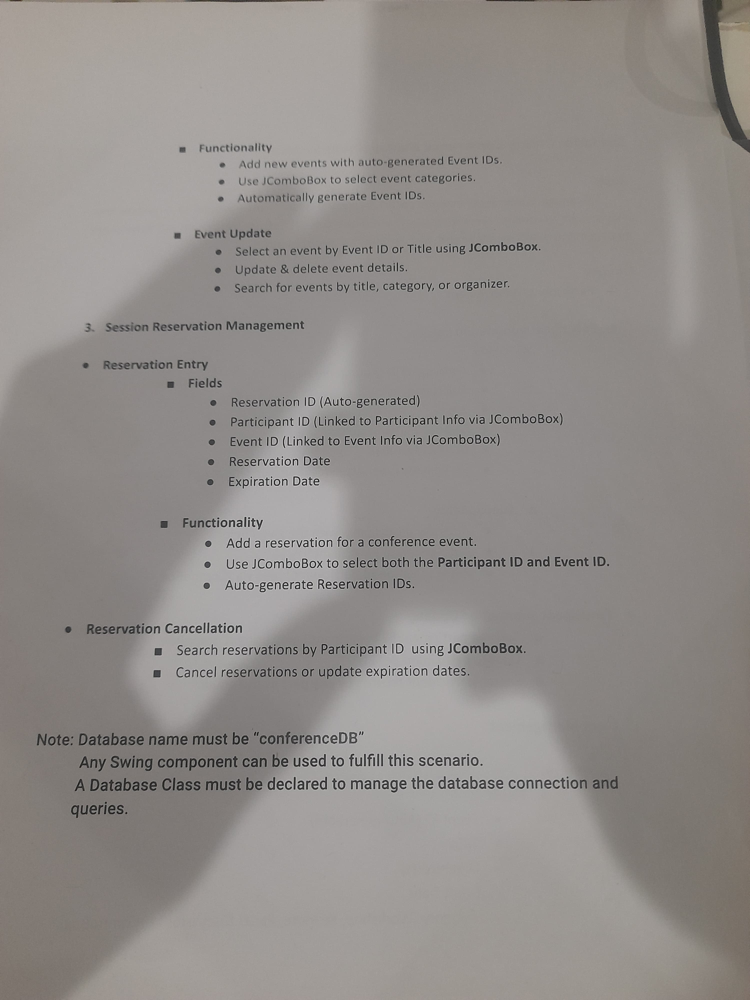

# OnlineConferenceManagementSystem
This is a project for the course "Software Application Development" at the Java Institute for Advanced Technology. The system is built using Java, Java Swing and MySQL.

## Context
This project was implemented for a 3 hour coding exam on the 13th of September 2024.
Here is the requirement document that was provided for the exam:

Sorry for the bad quality of the images, I had to take pictures of the requirement sheet with my phone.

## Database
You can find the database schema in the `db` folder.

## Notes
- The project was implemented in 3 hours, so it is not perfect.
- There are no validations for the input fields.
- Also here I use Java beans to store data in Pariticipant, but in other interfaces I use just SQL queries and Vector to store data.